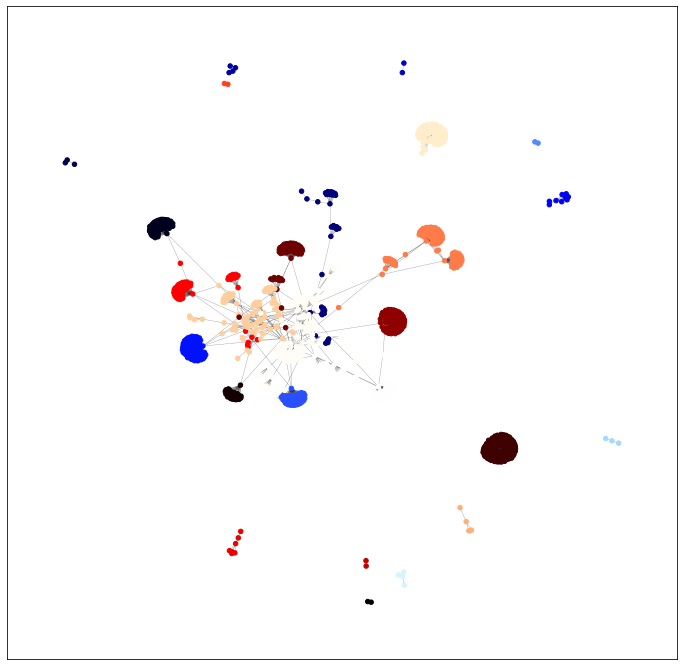
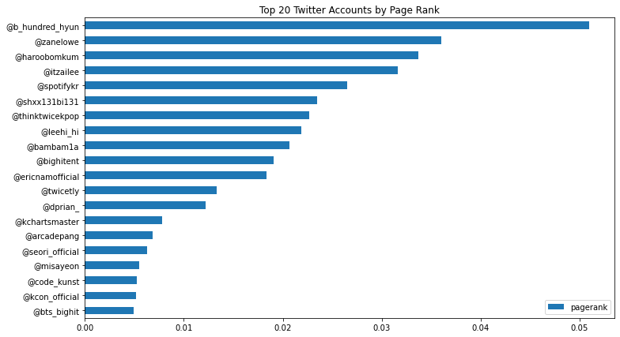
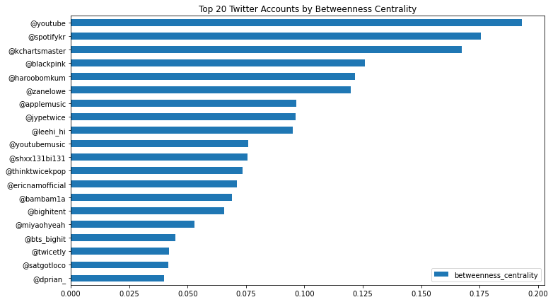
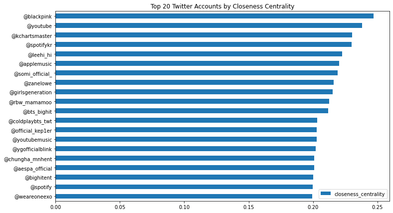

# Graph Analytics with Python

Graph analytics and network analysis using **Python**, **NetworkX**, and **Scikit-Network**.

---

## Overview

This project demonstrates graph analytics techniques on a real-world social network dataset. The notebook explores graph structures, node importance, and community detection using widely used graph algorithms.

---

## Technologies

- Python
- NetworkX
- Scikit-Network
- NumPy
- Pandas
- Matplotlib
- Jupyter Notebook

---

## Implemented Algorithms

- Network Visualization
- Community Detection (Louvain)
- PageRank
- Degree Centrality
- Betweenness Centrality
- Closeness Centrality
- Connected Components
- Bridge Detection

---

# Project Results

## Community Detection

---

## PageRank

---

## Betweenness Centrality

---

## Closeness Centrality

---

## Applications

- Social Network Analysis
- Recommendation Systems
- Cybersecurity
- Fraud Detection
- Complex Network Analysis

---

## Future Work

- Interactive graph visualization
- Graph Neural Networks (GNN)
- Large-scale graph datasets
- Communication network analysis
